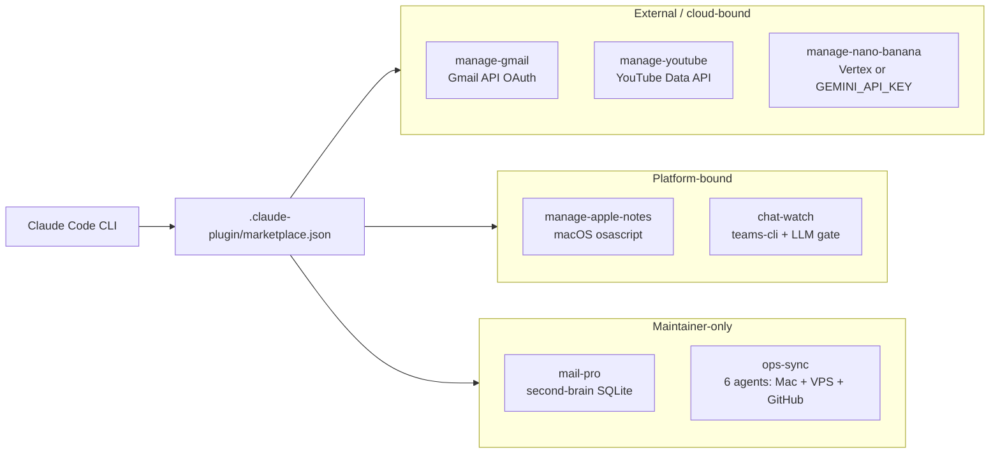

# plessas-lab

Experimental Claude Code plugins by [weirdapps](https://weirdapps.github.io/resume/). Everything in here needs a credential, a platform binding, or a private data store to be fully useful, which is why it lives in the "lab" rather than the stable [`plessas-marketplace`](https://github.com/weirdapps/plessas-marketplace).

[](https://github.com/weirdapps/plessas-lab/actions/workflows/validate-plugins.yml)
[](https://github.com/weirdapps/plessas-lab/actions/workflows/codeql.yml)
[](https://github.com/weirdapps/plessas-lab/actions/workflows/pii-check.yml)
[](https://github.com/weirdapps/plessas-lab/actions/workflows/rename-guard.yml)
[](https://github.com/weirdapps/plessas-lab/actions/workflows/sonarcloud.yml)
[](LICENSE)

## What it is

A public Claude Code marketplace of seven plugins that reach outside the local machine: Google APIs (Gmail, YouTube, Gemini image generation), macOS-only tooling (Apple Notes), Microsoft Teams (an LLM-gated chat monitor), a private email knowledge store, and a fleet-wide ops engine that scans Mac + VPS + GitHub health.

Companion to the sibling [`plessas-marketplace`](https://github.com/weirdapps/plessas-marketplace), which ships stable Microsoft 365 workplace plugins (mail, chat, decks, meetings, excel, docs) that work out of the box for any NBG colleague. Anything that needs Google OAuth, a Gemini API key, macOS-only APIs, SSH to a VPS, or the maintainer's private `second-brain` SQLite store lives here instead.

## Plugins

| Plugin | Version | Slash commands | What it does |
|---|---|---|---|
| [`manage-apple-notes`](./plugins/manage-apple-notes/) | 1.0.0 | `/apple-notes` | CRUD for Apple Notes via `osascript`. macOS only; the scripts exit cleanly on other platforms. Ships a `manage-apple-notes` skill. |
| [`manage-gmail`](./plugins/manage-gmail/) | 1.0.0 | `/gmail` | Gmail API (list, search, read, send, reply, forward, draft, profile). Node CLI under `skills/manage-gmail/scripts/`. OAuth 2.0 Desktop client required. |
| [`manage-nano-banana`](./plugins/manage-nano-banana/) | 1.0.0 | `/nano-banana`, `/create-nbg-infographic` | Image generation and editing via Google Gemini image models (`gemini-2.5-flash-image`, `gemini-3-pro-image-preview`). Works over Vertex AI (ADC) or a `GEMINI_API_KEY`. |
| [`manage-youtube`](./plugins/manage-youtube/) | 1.0.0 | `/youtube` | TypeScript CLI over YouTube: channel info, channel search, channel videos, transcripts, favorites, and playlist auth / manage / sync. Discovery works with no auth; playlist management needs YouTube Data API v3 OAuth. |
| [`chat-watch`](./plugins/chat-watch/) | 0.1.0 (experimental) | none (Python worker) | Polls Microsoft Teams chats and posts `[Claude]`-prefixed replies through an LLM gate. Long-lived process (launchd / systemd). Requires `teams-cli` authenticated. |
| [`mail-pro`](./plugins/mail-pro/) | 1.0.0 | `/comm-report`, `/style-rebuild` | Corpus-driven companion to `mail`: relationship analytics and style-guide rebuild against a private `second-brain` SQLite store. Maintainer-only. |
| [`ops-sync`](./plugins/ops-sync/) | 1.0.0 | `/ops-sync`, `/ops-status`, `/ops-fix`, `/ops-doctor` | Fleet health engine. Six agents (`repo-scanner`, `vps-auditor`, `github-checker`, `mac-auditor`, `sync-engine`, `fixer`) scan local repos, Hetzner VPS systemd timers, GitHub Actions, Mac LaunchAgents, and Mac / VPS HEAD alignment. Optional remediation. |

## Architecture



No real screenshots ship with this repo; the diagram above is the canonical visual reference.

## Installation

Claude Code discovers marketplaces by cloning them into its marketplaces directory:

```bash
mkdir -p ~/.claude/plugins/marketplaces
git clone https://github.com/weirdapps/plessas-lab.git \
  ~/.claude/plugins/marketplaces/plessas-lab
```

Then enable the plugins you want from the `/plugin` manager inside Claude Code.

Update later with:

```bash
cd ~/.claude/plugins/marketplaces/plessas-lab && git pull
```

## Usage

Typical entry points once a plugin is enabled:

```text
/apple-notes create "Weekly review" "..."
/gmail search from:boss@example.com after:2026/06/01
/nano-banana create a hero image for a fintech landing page
/create-nbg-infographic quarterly card revenue mix
/youtube channel @veritasium
/comm-report month --recipient theofilidi
/style-rebuild
/ops-status --live
/ops-sync --scope all
/ops-doctor vps
```

`chat-watch` has no slash command. It ships a Python CLI (`plugins/chat-watch/monitor.py`) that you run as a long-lived worker with per-chat config held outside the repo at `~/.claude/chat-watch/`. See [`plugins/chat-watch/README.md`](./plugins/chat-watch/README.md) for the first-run walkthrough (start in `--dry-run`).

## Configuration and secrets

Nothing sensitive is committed. Each plugin's README documents its own setup; summary:

| Plugin | Setup / auth |
|---|---|
| `manage-apple-notes` | macOS only. No credentials. |
| `manage-gmail` | Google Cloud project with Gmail API enabled + OAuth 2.0 Desktop client. Place `GMailSkill-Credentials.json` at `~/.google-skills/gmail/`; token is cached at `~/.google-skills/gmail/gmail_token.json` on first run. |
| `manage-nano-banana` | Either (a) Vertex AI via `GOOGLE_CLOUD_PROJECT` or `ANTHROPIC_VERTEX_PROJECT_ID` + ADC (`gemini-2.5-flash-image` only; defaults to `europe-west1`, override with `NANO_BANANA_VERTEX_LOCATION`), or (b) `GEMINI_API_KEY` from Google AI Studio (both models; required for `gemini-3-pro-image-preview`). |
| `manage-youtube` | Discovery: no auth. Playlist management: Google Cloud project with YouTube Data API v3 + OAuth 2.0 Desktop client. Data cached at `~/.google-skills/youtube/`. |
| `chat-watch` | `teams-cli auth-check` returns ok. Copy `chats.example.json` and `prompts/example_*.txt` into `~/.claude/chat-watch/` and edit. Keep `dry_run: true` for the first hour. |
| `mail-pro` | Requires the private `weirdapps/second-brain` repo cloned at `~/SourceCode/second-brain/` with `data/brain.db` populated. Not portable. |
| `ops-sync` | Expects the full `~/SourceCode/` layout, plus SSH access to the Hetzner VPS for systemd checks. |

Secrets stay out of the repo through `.gitignore`: `node_modules/`, `.env` / `.env.local`, `*credentials*.json`, `token.json`, `*.pem`, `*.key`, `skill-key/`. Personal `chat-watch` config lives entirely under `~/.claude/chat-watch/`, outside the repo.

## Repository layout

```text
plessas-lab/
  .claude-plugin/marketplace.json     Top-level manifest listing all seven plugins
  plugins/
    manage-apple-notes/               commands/, skills/manage-apple-notes/, tests/
    manage-gmail/                     commands/, skills/manage-gmail/ (Node + scripts/)
    manage-nano-banana/               commands/, skills/manage-nano-banana/ (Node + tools/)
    manage-youtube/                   commands/, skills/manage-youtube/ (TypeScript + tools/)
    chat-watch/                       monitor.py, prompts/, tests/, chats.example.json
    mail-pro/                         commands/, scripts/
    ops-sync/                         commands/, agents/ (6), shared/
  scripts/validate_consistency.py     Marketplace / plugin consistency check
  tests/auth-flow.test.ts             Top-level TypeScript test suite (vitest)
  .github/workflows/                  Seven CI workflows (see below)
  CLAUDE.md                           Project brief for Claude Code
  SECURITY.md
  LICENSE                             MIT
```

## Development and testing

```bash
# Node / TypeScript tests (top-level, vitest)
npm install
npm test
npm run test:coverage

# Python tests (chat-watch, manage-apple-notes; pytest with coverage)
pytest

# Lint
ruff check .
mypy .
```

`pyproject.toml` pins Python 3.11, a ruff rulepack of E, W, F, I, B, C4, UP, and runs pytest with `--cov` so SonarCloud always gets a fresh `coverage.xml`. `package.json` requires Node 20+.

Adding a new plugin:

1. Create `plugins/<name>/.claude-plugin/plugin.json` with `name`, `description`, `version` (all validated by CI).
2. Add command files under `plugins/<name>/commands/*.md`; every command MUST start with a YAML frontmatter block (`---` on line 1). CI rejects any command missing frontmatter.
3. Add `plugins/<name>/README.md`.
4. Register the plugin in `.claude-plugin/marketplace.json` under `"plugins"`.
5. Keep credentials out of the repo; the `.gitignore` patterns above already cover the usual suspects.

## Continuous integration

Seven workflows under `.github/workflows/`:

| Workflow | Trigger | Purpose |
|---|---|---|
| `validate-plugins.yml` | push / PR on master | `marketplace.json` and every `plugin.json` are valid JSON with the required fields; per-plugin README present; every command has YAML frontmatter; also runs `scripts/validate_consistency.py`. |
| `codeql.yml` | push / PR / weekly cron | GitHub CodeQL for JavaScript and TypeScript. |
| `pii-check.yml` | push / PR | Runs `installers/pii-gauntlet.sh --mode=ci` to scan git-tracked files for personal data. |
| `rename-guard.yml` | push / PR | Fails if a legacy pre-rename project name (from the 2026-05-09 renames) leaks back into tracked files. |
| `sonarcloud.yml` | push / PR / manual | Runs tests with coverage and, when `SONAR_TOKEN` is set, uploads to SonarCloud. |
| `deps-refresh.yml` | monthly cron (22nd, 07:11 UTC) | Delegates to `weirdapps/shared-workflows` monthly refresh; gate is `npm test`. |
| `dependabot-auto-merge.yml` | Dependabot PRs | Auto-merges minor and patch bumps. |

## License

MIT. See [LICENSE](./LICENSE). Individual plugins carry their own MIT declaration in their `plugin.json`.
